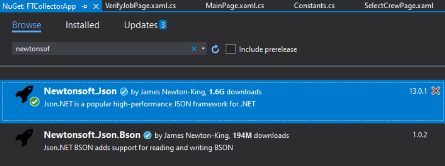
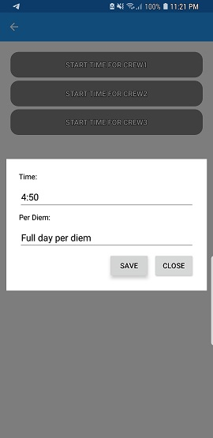

# Fibertrak CollectorApp
> This repo recap Xamarin cross platform implementation from collector.fibertrak.com/phonev4 Web-App.

Almost all page in colector apps has similar process :
* [Create Local SQLite](https://github.com/labdevsrc/FTCollectorApp/blob/master/README.md#1-create-local-sqlite)
* [Ajax /API Request via HttpClient](https://github.com/labdevsrc/FTCollectorApp/blob/master/README.md#2-ajax-request--api-access-to-backup_of_myfibertrakend_user)
* [Populate local SQLite and List var with table from MySQL](https://github.com/labdevsrc/FTCollectorApp/blob/master/README.md#3-populate-local-sqlite-and-xamarin-linq)
* Use table's columns to populate entries in each pages
* If there's change , submit change with button 
> Note 
> Now : Do HttpRequest to AWS MySQL table each time Page event OnAppearing() fires
> v2 :  GET whole tables at first time Collector installation later
Extras :
* [Popup View] (https://github.com/labdevsrc/FTCollectorApp#popup-view)
* [Signature Pad] (https://github.com/labdevsrc/FTCollectorApp#signature-pad)


## Login 
>MainPage.xaml.cs


## 1. Create Local SQLite
### Download sqlite-net-pcl from NuGET's Visual Studio

### Add below code on Solution.Android file MainActivity.cs
[source code link](https://github.com/labdevsrc/FTCollectorApp/blob/911e1be4d5d3fd0e7b1bc48602ae7a3effc1835c/FTCollectorApp.Android/MainActivity.cs#L24)
```
        protected override void OnCreate(Bundle savedInstanceState)
        {
        ....
            // SQLite initial
            string dbName = "myfibertrak_db.sqlite"; // SQLite db filename
            string folderPath = System.Environment.GetFolderPath(System.Environment.SpecialFolder.Personal);
            string fullPath = Path.Combine(folderPath, dbName);

            LoadApplication(new App());
         }
```

### Add below code on Solution.iOS file AppDelegate.cs
[source code link](https://github.com/labdevsrc/FTCollectorApp/blob/911e1be4d5d3fd0e7b1bc48602ae7a3effc1835c/FTCollectorApp.iOS/AppDelegate.cs#L29)
```
        public override bool FinishedLaunching(UIApplication app, NSDictionary options)
        {
        ....
            // SQLite Dependency for iOS
            string dbName = "myfibertrak_db.sqlite"; // SQLite db filename
            string folderPath = Path.Combine(System.Environment.GetFolderPath(System.Environment.SpecialFolder.Personal), "..", "Library");
            string fullPath = Path.Combine(folderPath, dbName);
         }
```

### Add constructor overloading in App.xaml.cs
[source code link](https://github.com/labdevsrc/FTCollectorApp/blob/e1ad57815275c9dd32af659c0d17cdf0ec6cc0e3/FTCollectorApp/App.xaml.cs#L19)
```
    public partial class App : Application
    {
        public static string DatabaseLocation = string.Empty;
        public App(string databaseLoc) // database location as param
        {
            InitializeComponent();

            MainPage = new NavigationPage(new MainPage());
            DatabaseLocation = databaseLoc;

        }
```   

### Create AJAX / API script in collector.fibertrak.com cloud
example collector.fibertrak.com/phonev4/xamarinLogin.php 
[source code link](https://github.com/labdevsrc/FTCollectorApp/blob/3ee92bf7366ab83679f04040ffa418596dc43234/collector.fibertrak.com/phonev4/xamarinLogin.php#L1)
```
<?php
	include "conn.php";
	
	$sql="select email, end_user.key as UserKey, password, first_name, last_name, created_on from end_user where record_state='L' and field_data_collection='Y'";
	$res= mysqli_query($con,$sql);	
	$data = array();
	while($row = mysqli_fetch_assoc($res)){
		$data[] = $row;
	}
	echo json_encode($data);
?>
```
Note : JSON column key in , must match with User class properties in User.cs

### Create User or End_User class that has same structure with MySQL table.
For Login page, we use end_user table with column id, key,first_name, last_name, password,...
[source code link](https://github.com/labdevsrc/FTCollectorApp/blob/9a33cec3d2cb25e169538dc2ee12cfdbd62e8cb4/FTCollectorApp/Model/User.cs#L4)
``` 
using SQLite; // sqlite-net-pcl library directive 

public class User{

	// set id as PK and autoincrement
	[PrimaryKey, AutoIncrement] 
        public int id {get; set;}   // use snippet by typing "prop" then tab2x
        
	public int UserKey {get; set;} 
        public string email {get;set;}
        public string password {get;set;} 
        public string first_name {get;set;}    
        public string last_name {get;set;}    
        ...
        public string created_on {get;set;}        
}
```

## 2. Ajax request / API access to `backup_of_myfibertrak.end_user` 
### install NUGet NewtonSoft


Each page has default event handler right after Page appearing , called : OnAppearing().
In this repo , downloaded MySQL table will be stored in local SQLite, and then populate to List<T> or ObservableCollection<Object>.
[link to OnAppearing() in MainPage.xaml.cs](https://github.com/labdevsrc/FTCollectorApp/blob/095c644593bf3ad4ec01366bf75a8ad3358191af/FTCollectorApp/Page/MainPage.xaml.cs#L37)

```
    public partial class MainPage : ContentPage
    {
        private HttpClient httpClient = new HttpClient(); // create new HttpClient
        private ObservableCollection<User> Users;
        ...
        
        protected override async void OnAppearing()
        {
            base.OnAppearing();

            Console.WriteLine("Connectivity : " + Connectivity.NetworkAccess);

            // if Internet connection available 
            if (Connectivity.NetworkAccess == NetworkAccess.Internet)
            {

                Users.Clear();
                // grab End User tables from Url https://collector.fibertrak.com/phonev4/xamarinLogin.php
                // Constants.GetEndUserTableUrl = "https://collector.fibertrak.com/phonev4/xamarinLogin.php"
                var response = await httpClient.GetStringAsync(Constants.GetEndUserTableUrl); 
                var content = JsonConvert.DeserializeObject<List<User>>(response);
                Users = new ObservableCollection<User>(content);
                Console.WriteLine(response);

		// Populate local SQLite 
                using (SQLiteConnection conn = new SQLiteConnection(App.DatabaseLocation))
                {
                    conn.CreateTable<User>();
                    conn.InsertAll(content); // populate SQLite table myfibertrak_db.db3
                }
            }
```
        
## 3. Populate local SQLite and Query with Xamarin LINQ
refer to previous section [link to source code](https://github.com/labdevsrc/FTCollectorApp/blob/095c644593bf3ad4ec01366bf75a8ad3358191af/FTCollectorApp/Page/MainPage.xaml.cs#L52)
	
```
		// Populate local SQLite 
                using (SQLiteConnection conn = new SQLiteConnection(App.DatabaseLocation))
                {
                    conn.CreateTable<User>();
                    conn.InsertAll(content); // populate SQLite table myfibertrak_db.db3
                }
```
now, if user online, end_user table's content already populated to local SQLite.
in case user not online or no internet network, apps will read from local SQLite   [link to source code](https://github.com/labdevsrc/FTCollectorApp/blob/095c644593bf3ad4ec01366bf75a8ad3358191af/FTCollectorApp/Page/MainPage.xaml.cs#L62)
	
```
            if (Connectivity.NetworkAccess == NetworkAccess.Internet)
            {
		// 
	     }
	     else
	     {
                using (SQLiteConnection conn = new SQLiteConnection(App.DatabaseLocation))
                {
                    conn.CreateTable<User>();
                    var userdetails = conn.Table<User>().ToList();
                    Users = new ObservableCollection<User>(userdetails);
                }
             }
```
### Query with Xamarin LINQ	
Class that populated with datas simply can do Query with Xamarin LINQ. For example, we want to select first_name or last_name from class Users where  email input `entryEmail.Text` and password entry `entryPassword.Text` we're known.
	
So, We can do query like this 
`SELECT first_name FROM Users WHERE email =  entryEmail.Text and password = entryPassword.Text`
with LINQ as below :
	
[source code link](https://github.com/labdevsrc/FTCollectorApp/blob/095c644593bf3ad4ec01366bf75a8ad3358191af/FTCollectorApp/Page/MainPage.xaml.cs#L86)
```
	txtFirstName.Text = Users.Where(a => (a.email == entryEmail.Text) && (a.password == entryPassword.Text)).Select(a => a.first_name).First();
	txtLastName.Text = Users.Where(a => (a.email == entryEmail.Text) && (a.password == entryPassword.Text)).Select(a => a.last_name).First();
```


## Verify Job Page 
> VerifyJobPage.xaml and VerifyJobPage.xaml.cs
	


### Job Class
[class link](https://github.com/labdevsrc/FTCollectorApp/blob/3ee92bf7366ab83679f04040ffa418596dc43234/FTCollectorApp/Model/Job.cs#L8)
	
```
using SQLite;

namespace FTCollectorApp.Model
{
    public class Job
    {
        [PrimaryKey, AutoIncrement]
        public int Id { get; set; }
        public int OwnerKey { get; set; }
        public string OWNER_CD { get; set; }
        public string OwnerName { get; set; }
        public string JobNumber { get; set; }
        public string JobLocation { get; set; }
        public string ContactName { get; set; }
        public string CustomerName { get; set; }
        public string CustomerPhone { get; set; }
        public string table_name { get; set; }
    }
}
```
	
## Popup View
> Example [GPS popup]()



	
	
## 1. Create Popup View
* [Download Rg.plugins.popup from NuGet](assets/nuget_RGplugins.png)
* Add initiliazation on Android solution's MainActivity.cs and iOS solution's AppDelegate.cs
AppDelegate.cs
`Rg.Plugins.Popup.Popup.Init();`

	
## Signature Pad
> Example [Signature Pad]()
[Source link :](https://www.c-sharpcorner.com/article/how-to-create-a-signaturepad-using-xamarin-forms/)

## 1. Create Signature pad
* [Download Signature Pad Forms from NuGet](assets/nuget_signaturePad.png)
	
