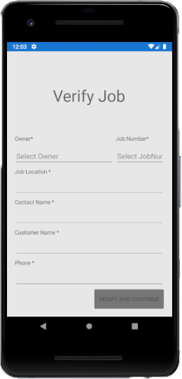

# Fibertrak CollectorApp



# Login (MainPage.xaml.cs)
Almost all page in colector apps has similar process :
* Create Local SQLite
* GET each table from AWS MySQL myfibertrak --> this will be changed to GET whole tables at first time Collector install
* Populate local SQLite and List var with table from MySQL
* Use table's columns to populate entries in each pages
* If there's change , submit change with button 


## 1. Create class Job
```
```
## 2. Ajax request / API access to `backup_of_myfibertrak.end_user` as below :
```
protected override async void OnAppearing()
{
    base.OnAppearing();

    Console.WriteLine("Connectivity : " + Connectivity.NetworkAccess);
    
    // if Internet connection available 
    if (Connectivity.NetworkAccess == NetworkAccess.Internet)
    {

        Users.Clear();
        // grab End User tables from Url https://collector.fibertrak.com/phonev4/xamarinLogin.php
        // Constants.GetEndUserTableUrl = "https://collector.fibertrak.com/phonev4/xamarinLogin.php"
        var response = await httpClient.GetStringAsync(Constants.GetEndUserTableUrl); 
        var content = JsonConvert.DeserializeObject<List<User>>(response);
        Users = new ObservableCollection<User>(content);
        Console.WriteLine(response);

        using (SQLiteConnection conn = new SQLiteConnection(App.DatabaseLocation))
        {
            conn.CreateTable<User>();
            conn.InsertAll(content);
        }
    }
```
